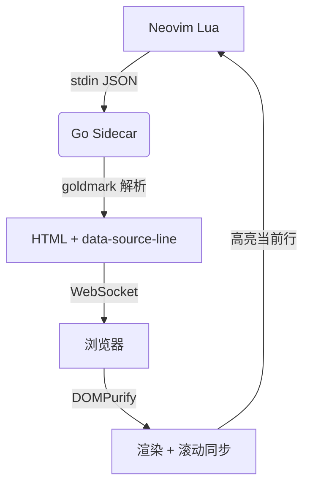
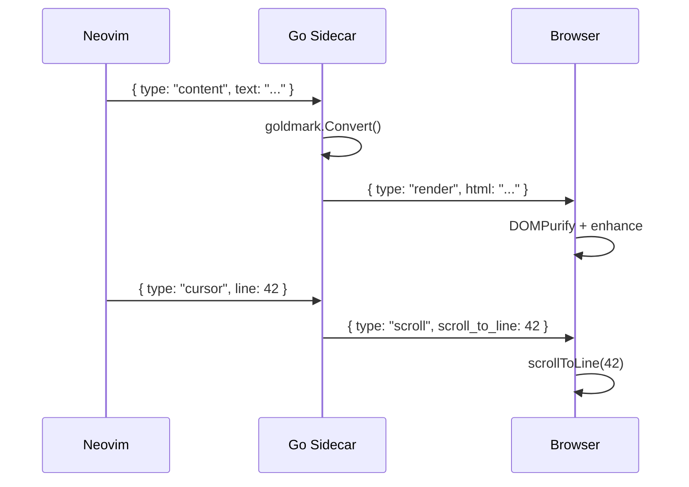
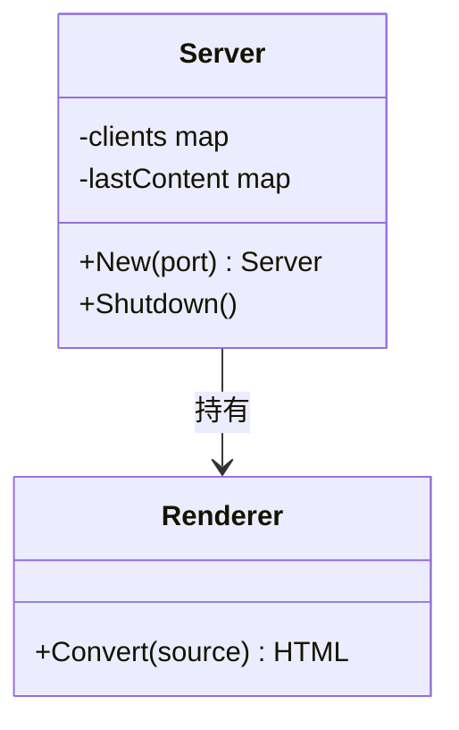
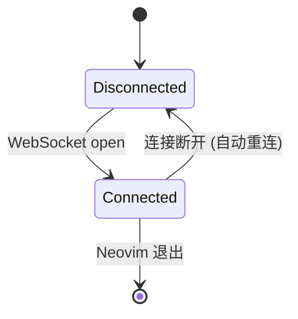
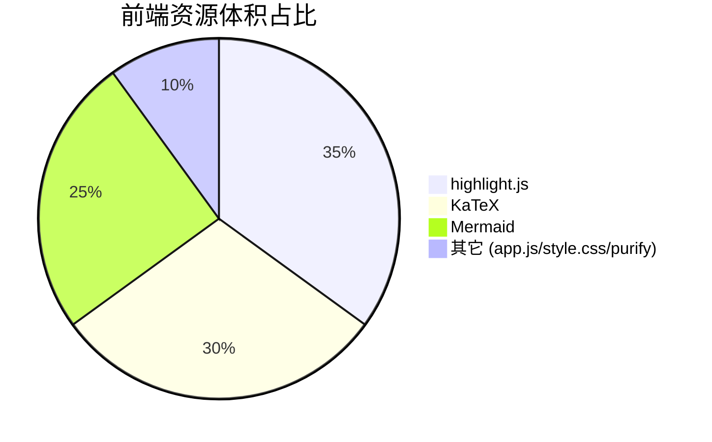
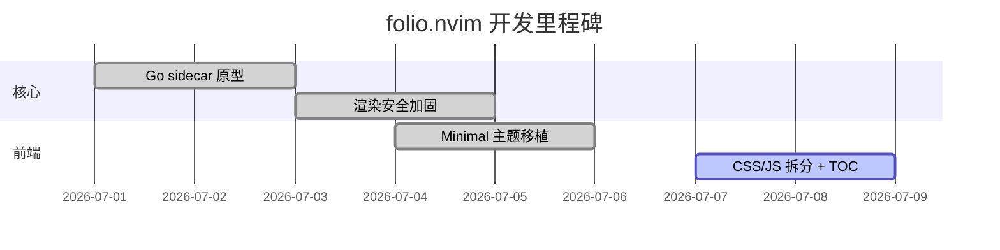

# folio.nvim 渲染测试文档

> 本文件覆盖 folio 支持的**全部** Markdown 语法与渲染增强能力，用于验证 Minimal 主题在各元素上的表现。
> 用 `:FolioPreview` 打开本文件，点击右上角圆形按钮可展开**目录（TOC）**逐节跳转查看。

## 目录跳转（TOC）

右上角悬浮按钮会在文档存在标题时出现，点击展开右侧目录面板：

- 目录按标题层级（H1–H6）缩进展示，取自渲染后每个标题自动生成的 GitHub 风格锚点 `id`（如本标题为 `#目录跳转toc`）
- 点击目录项会平滑滚动到对应标题、更新地址栏 `#hash`，并自动收起面板
- 随文档滚动，当前所在章节会在目录中高亮
- 同名标题会自动去重编号（例如连续三个「概述」会依次生成 `#概述`、`#概述-1`、`#概述-2`）

## 标题层级

# 一级标题 H1

## 二级标题 H2

### 三级标题 H3

#### 四级标题 H4

##### 五级标题 H5（small-caps）

###### 六级标题 H6（small-caps）

> 每个标题都会生成一个可深链的锚点 id，例如把浏览器地址栏改成 `...#三级标题-h3` 即可直接定位到上面的「三级标题 H3」。重复标题文本会自动追加 `-1`、`-2` 后缀去重。

## 段落与行内元素

这是一段普通正文。Lorem ipsum dolor sit amet, consectetur adipiscing elit.
支持**加粗**、_斜体_、**_加粗斜体_**、~~删除线~~、`行内代码`、==高亮标记==。

其它行内元素：<mark>mark 标签</mark>、<abbr title="HyperText Markup Language">HTML 缩写 abbr</abbr>、
上标 H<sub>2</sub>O、下标 E=mc<sup>2</sup>、键盘键 <kbd>Ctrl</kbd> + <kbd>S</kbd>。

### 链接与自动识别（Linkify）

- 尖括号自动链接：<https://github.com/liubang/folio.nvim> 和邮箱 <it.liubang@gmail.com>
- **裸 URL 自动识别**（无需尖括号）：直接粘贴 https://example.com 或 www.github.com 也会被识别成链接
- 行内链接：[folio.nvim](https://github.com/liubang/folio.nvim "项目主页")，以及带强调的链接 **[加粗链接](https://example.com)**

### 删除线（GFM Strikethrough）

- ~~这行文字已被删除线标记~~
- 也可以~~部分~~保留：这句话中间~~这几个字~~被删除线标记。

## 引用块

> 这是一个普通引用块。
> 第二行内容。
>
> 引用块内的第二段。

### 嵌套引用

> 外层引用
>
> > 内层引用
> >
> > > 更深层嵌套

## 提示框（Admonitions）

> [!NOTE]
> 这是一个 NOTE 提示框，用于补充说明信息。

> [!TIP]
> 这是一个 TIP 提示框，用于给出建议。

> [!IMPORTANT]
> 这是一个 IMPORTANT 提示框，用于强调关键信息。

> [!WARNING]
> 这是一个 WARNING 提示框，用于提醒注意。

> [!CAUTION]
> 这是一个 CAUTION 提示框，用于警示危险操作。

> [!note]
> 类型标识大小写不敏感：小写 `[!note]` 效果与 `[!NOTE]` 完全一致。

## 列表

### 无序列表

- 第一项
- 第二项
  - 嵌套项 2.1
  - 嵌套项 2.2
    - 更深嵌套
- 第三项

### 有序列表

1. 第一步
2. 第二步
   1. 子步骤 2.1
   2. 子步骤 2.2
3. 第三步

### 任务列表

- [x] 已完成的任务
- [x] 另一个已完成项
- [ ] 未完成的任务
- [ ] 另一个未完成项
  - [x] 嵌套的已完成子任务
  - [ ] 嵌套的未完成子任务

## 代码块

### 带语言标注的代码块（含复制按钮 + 语言徽标）

```go
package main

import "fmt"

func main() {
    // folio 的 Go 后端示例
    nums := []int{1, 2, 3, 4, 5}
    sum := 0
    for _, n := range nums {
        sum += n
    }
    fmt.Printf("sum = %d\n", sum)
}
```

```python
def fibonacci(n: int) -> list[int]:
    """生成前 n 个斐波那契数。"""
    seq = [0, 1]
    while len(seq) < n:
        seq.append(seq[-1] + seq[-2])
    return seq[:n]


if __name__ == "__main__":
    print(fibonacci(10))
```

```javascript
// 异步获取数据示例
async function fetchUser(id) {
  const res = await fetch(`/api/users/${id}`);
  if (!res.ok) throw new Error(`HTTP ${res.status}`);
  return res.json();
}

const user = await fetchUser(42);
console.log(user.name);
```

```bash
# 构建并运行 folio
make build
./build/folio -port 0

# 交叉编译
make build-all
```

```json
{
  "name": "folio.nvim",
  "version": "1.0.0",
  "features": ["live-preview", "scroll-sync", "math", "diagrams"],
  "offline": true
}
```

```yaml
# 未在 highlight.js 内置语言列表中的示例：YAML 同样能正确高亮
name: folio
on:
  push:
    tags: ["v*"]
```

### 缩进代码块（无语言标注）

    这是一个缩进代码块。
    没有语法高亮，也没有语言徽标。
    但复制按钮仍然可用。

## 数学公式（KaTeX）

行内公式：质能方程 $E = mc^2$，欧拉公式 $e^{i\pi} + 1 = 0$。

块级公式：

$$
\int_{-\infty}^{\infty} e^{-x^2} \, dx = \sqrt{\pi}
$$

$$
\mathbf{A} = \begin{bmatrix} a_{11} & a_{12} \\ a_{21} & a_{22} \end{bmatrix}, \quad \det(\mathbf{A}) = a_{11}a_{22} - a_{12}a_{21}
$$

用反斜杠定界符的公式：

\[
f(x) = \sum\_{n=0}^{\infty} \frac{f^{(n)}(0)}{n!} x^n
\]

## Mermaid 图表

### 流程图



### 时序图



### 类图



### 状态图



### 饼图



### 甘特图



## 表格

### 基础表格

| 命令                       | 描述                   | 默认 |
| -------------------------- | ---------------------- | ---- |
| `:FolioPreview`            | 在浏览器打开预览       | -    |
| `:FolioClose`              | 关闭当前 buffer 的预览 | -    |
| `:FolioCloseAll`           | 关闭全部预览           | -    |
| `require("folio").setup()` | 配置插件               | -    |

### 含行内标记的表格

| 名称              | 类型   | 状态      | 链接                           |
| ----------------- | ------ | --------- | ------------------------------ |
| **bold**          | `code` | ✅ 完成   | [docs](https://example.com)    |
| _italic_          | `ref`  | ⏳ 进行中 | [repo](https://github.com)     |
| ~~strikethrough~~ | `tmp`  | ❌ 已弃用 | [ref](https://example.com/ref) |
| `inline`          | normal | 🚧 草案   | <https://example.com>          |

### 对齐方式（左 / 中 / 右）

| 左对齐 | 居中对齐 | 右对齐 |
| :----- | :------: | -----: |
| a      |    b     |      c |
| 短文本 |  中等长度文本  | 12345 |

### 宽表格（横向滚动 + 短标签不换行）

| 路径                                   | 说明                             | 备注                       |
| -------------------------------------- | -------------------------------- | -------------------------- |
| `internal/markdown/renderer.go`        | Goldmark 自定义渲染器            | `bigdata/` 类短代码不换行  |
| `cd internal/server && go test ./...`  | 运行 server 包测试的命令示例     | 长命令允许横向滚动查看     |

## 水平分割线

上方内容。

---

下方内容。

## 图片（点击放大）


> 图片支持点击放大（lightbox 遮罩层），按 `Esc` 或点击遮罩关闭。
>
> 除了绝对 URL，folio 也支持**相对路径图片**：`` 这类写法会被自动改写为
> `/files/{bufnr}/assets/screenshot.png`，由 Go sidecar 按当前 markdown 文件所在目录解析并回源，
> 因此本地相对路径引用的图片、附件同样可以正常预览（含基本的路径穿越防护）。

## HTML 透传（WithUnsafe）

<details>
<summary>点击展开详情（details / summary）</summary>

这是一个折叠块。goldmark 的 `WithUnsafe()` 允许原始 HTML 直接输出，
前端用 DOMPurify 净化后保留 `<details>` 语义。

- 列表项 A
- 列表项 B

```go
// 折叠块内也可以有代码
fmt.Println("hello from details")
```

</details>

<details open>
<summary>默认展开的折叠块（&lt;details open&gt;）</summary>

带 `open` 属性的 `<details>` 首次渲染即为展开状态，箭头指示器同步旋转 90°。

</details>

<div style="padding: 0.75em 1em; border-radius: 6px; background: var(--bg2); border: 1px solid var(--ui1);">
直接透传的 <code>&lt;div&gt;</code> + 内联样式：由于 goldmark 开启了 <code>WithUnsafe()</code>，
原始 HTML 块（不仅是 details/summary）也会被保留，前端 DOMPurify 会净化掉危险标签/属性
（如 <code>&lt;script&gt;</code>、<code>onclick</code>），但保留安全的结构与样式。
</div>

## 脚注

folio 支持 PHP Markdown Extra 风格的脚注语法 `text[^label]` + `[^label]: 说明`。
点击正文中的上标数字会跳转到文末脚注列表，点击脚注末尾的 ↩ 可跳回引用处。

这是一个基本论断[^1]，脚注会自动编号并收集到本节末尾。

脚注定义也可以包含**行内格式**、`代码` 甚至多段落内容[^detail]。

同一个脚注还能被多次引用[^shared]，比如这里再引用一次[^shared]，
每处引用都会生成独立的返回箭头，点击任意一个都会跳回对应的引用位置。

[^1]: 这是第一个脚注的说明文字。
[^detail]: 脚注内容支持**加粗**、`行内代码`、[链接](https://github.com/liubang/folio.nvim)。

    甚至可以包含缩进的第二段落，以及代码块：

    ```go
    fmt.Println("脚注里的代码块")
    ```

[^shared]: 这个脚注被引用了两次，注意文末会出现两个返回箭头（↩ ↩）。

## 字符转义

Markdown 转义字符演示：\*这不是斜体\*、\`这不是代码\`、\#这不是标题、\[这不是链接\]。

---

**至此本文档覆盖了 folio 支持的全部渲染能力**：

- **结构**：6 级标题（含自动锚点 id 与目录跳转 TOC）、段落、水平分割线
- **行内格式**：加粗 / 斜体 / 加粗斜体 / 删除线 / 高亮 / 行内代码 / kbd / sub / sup / mark / abbr
- **链接**：尖括号自动链接、裸 URL 自动识别（Linkify）、行内链接、标题属性
- **引用与提示框**：引用块及多级嵌套、5 种 GitHub 风格 admonition（大小写不敏感）
- **列表**：有序 / 无序 / 多级嵌套 / 任务列表（含嵌套任务）
- **代码**：带语言标注（语法高亮 + 语言徽标 + 复制按钮）与缩进代码块
- **数学公式**：KaTeX 行内、块级、`$$`/`\[...\]` 两种定界符、矩阵等复杂公式
- **图表**：Mermaid 流程图 / 时序图 / 类图 / 状态图 / 饼图 / 甘特图
- **表格**：基础表格、含行内标记表格、左 / 中 / 右三种对齐方式、宽表格横向滚动
- **媒体**：图片点击放大（lightbox）、相对路径图片解析（`/files/{bufnr}/...`）
- **HTML 透传**：`details`/`summary`（含默认展开）、任意安全 HTML 块级元素（经 DOMPurify 净化）
- **脚注**：PHP Markdown Extra 语法 `[^label]`、多段落/代码脚注内容、多次引用与多返回箭头
- **交互增强**：滚动同步（编辑器光标 ↔ 预览高亮）、深色模式自动切换、目录（TOC）跳转
- **转义**：反斜杠转义特殊字符

在 Minimal 主题下逐节滚动检查，可确认每种元素均已正确配色与排版；也可以展开右上角目录面板，
逐条点击跳转，验证锚点定位与高亮是否准确。
