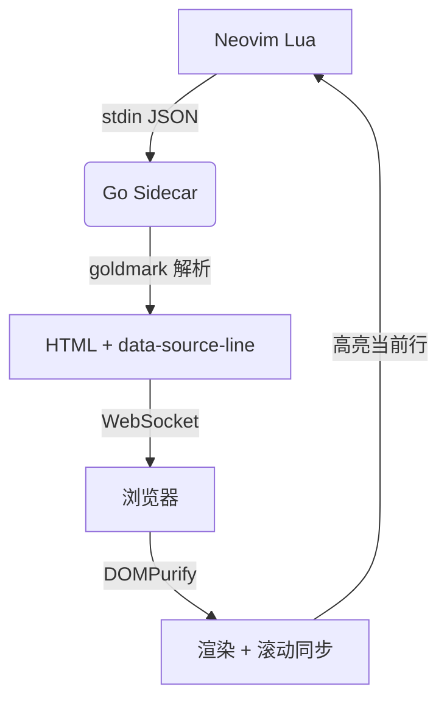
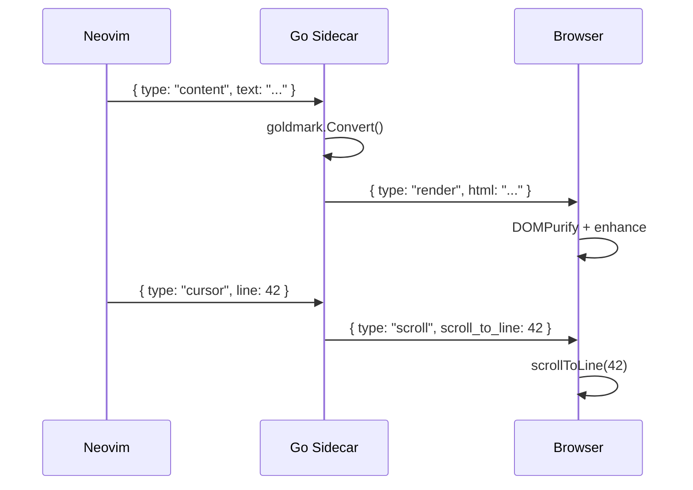

# folio.nvim 渲染测试文档

> 本文件覆盖 folio 支持的**全部** Markdown 语法，用于验证 Minimal 主题在各元素上的表现。
> 用 `:FolioPreview` 打开本文件即可逐节查看。

## 标题层级

# 一级标题 H1

## 二级标题 H2

### 三级标题 H3

#### 四级标题 H4

##### 五级标题 H5（small-caps）

###### 六级标题 H6（small-caps）

## 段落与行内元素

这是一段普通正文。Lorem ipsum dolor sit amet, consectetur adipiscing elit.
支持**加粗**、_斜体_、**_加粗斜体_**、~~删除线~~、`行内代码`、==高亮标记==。

其它行内元素：<mark>mark 标签</mark>、<abbr title="HyperText Markup Language">HTML 缩写 abbr</abbr>、
上标 H<sub>2</sub>O、下标 E=mc<sup>2</sup>、键盘键 <kbd>Ctrl</kbd> + <kbd>S</kbd>。

支持自动链接：<https://github.com/liubang/folio.nvim> 和邮箱 <it.liubang@gmail.com>。

行内链接：[folio.nvim](https://github.com/liubang/folio.nvim "项目主页")，以及带强调的链接 **[加粗链接](https://example.com)**。

## 引用块

> 这是一个普通引用块。
> 第二行内容。
>
> 引用块内的第二段。

### 嵌套引用

> 外层引用
>
> > 内层引用
> >
> > > 更深层嵌套

## 提示框（Admonitions）

> [!NOTE]
> 这是一个 NOTE 提示框，用于补充说明信息。

> [!TIP]
> 这是一个 TIP 提示框，用于给出建议。

> [!IMPORTANT]
> 这是一个 IMPORTANT 提示框，用于强调关键信息。

> [!WARNING]
> 这是一个 WARNING 提示框，用于提醒注意。

> [!CAUTION]
> 这是一个 CAUTION 提示框，用于警示危险操作。

## 列表

### 无序列表

- 第一项
- 第二项
  - 嵌套项 2.1
  - 嵌套项 2.2
    - 更深嵌套
- 第三项

### 有序列表

1. 第一步
2. 第二步
   1. 子步骤 2.1
   2. 子步骤 2.2
3. 第三步

### 任务列表

- [x] 已完成的任务
- [x] 另一个已完成项
- [ ] 未完成的任务
- [ ] 另一个未完成项

## 代码块

### 带语言标注的代码块（含复制按钮 + 语言徽标）

```go
package main

import "fmt"

func main() {
    // folio 的 Go 后端示例
    nums := []int{1, 2, 3, 4, 5}
    sum := 0
    for _, n := range nums {
        sum += n
    }
    fmt.Printf("sum = %d\n", sum)
}
```

```python
def fibonacci(n: int) -> list[int]:
    """生成前 n 个斐波那契数。"""
    seq = [0, 1]
    while len(seq) < n:
        seq.append(seq[-1] + seq[-2])
    return seq[:n]


if __name__ == "__main__":
    print(fibonacci(10))
```

```javascript
// 异步获取数据示例
async function fetchUser(id) {
  const res = await fetch(`/api/users/${id}`);
  if (!res.ok) throw new Error(`HTTP ${res.status}`);
  return res.json();
}

const user = await fetchUser(42);
console.log(user.name);
```

```bash
# 构建并运行 folio
make build
./build/folio -port 0

# 交叉编译
make build-all
```

```json
{
  "name": "folio.nvim",
  "version": "1.0.0",
  "features": ["live-preview", "scroll-sync", "math", "diagrams"],
  "offline": true
}
```

### 缩进代码块（无语言标注）

    这是一个缩进代码块。
    没有语法高亮，也没有语言徽标。
    但复制按钮仍然可用。

## 数学公式（KaTeX）

行内公式：质能方程 $E = mc^2$，欧拉公式 $e^{i\pi} + 1 = 0$。

块级公式：

$$
\int_{-\infty}^{\infty} e^{-x^2} \, dx = \sqrt{\pi}
$$

$$
\mathbf{A} = \begin{bmatrix} a_{11} & a_{12} \\ a_{21} & a_{22} \end{bmatrix}, \quad \det(\mathbf{A}) = a_{11}a_{22} - a_{12}a_{21}
$$

用反斜杠定界符的公式：

\[
f(x) = \sum\_{n=0}^{\infty} \frac{f^{(n)}(0)}{n!} x^n
\]

## Mermaid 图表





## 表格

### 基础表格

| 命令                       | 描述                   | 默认 |
| -------------------------- | ---------------------- | ---- |
| `:FolioPreview`            | 在浏览器打开预览       | -    |
| `:FolioClose`              | 关闭当前 buffer 的预览 | -    |
| `:FolioCloseAll`           | 关闭全部预览           | -    |
| `require("folio").setup()` | 配置插件               | -    |

### 含行内标记的表格

| 名称              | 类型   | 状态      | 链接                           |
| ----------------- | ------ | --------- | ------------------------------ |
| **bold**          | `code` | ✅ 完成   | [docs](https://example.com)    |
| _italic_          | `ref`  | ⏳ 进行中 | [repo](https://github.com)     |
| ~~strikethrough~~ | `tmp`  | ❌ 已弃用 | [ref](https://example.com/ref) |
| `inline`          | normal | 🚧 草案   | <https://example.com>          |

## 水平分割线

上方内容。

---

下方内容。

## 图片（点击放大）


## HTML 透传（WithUnsafe）

<details>
<summary>点击展开详情（details / summary）</summary>

这是一个折叠块。goldmark 的 `WithUnsafe()` 允许原始 HTML 直接输出，
前端用 DOMPurify 净化后保留 `<details>` 语义。

- 列表项 A
- 列表项 B

```go
// 折叠块内也可以有代码
fmt.Println("hello from details")
```

</details>

## 脚注与转义

Markdown 转义字符演示：\*这不是斜体\*、\`这不是代码\`、\#这不是标题、\[这不是链接\]。

---

**至此本文档覆盖了 folio 支持的全部语法**：6 级标题、行内格式（加粗 / 斜体 / 删除线 /
高亮 / 代码 / kbd / sub / sup / abbr）、链接与自动链接、引用块及嵌套、5 种 admonition、
有序 / 无序 / 嵌套 / 任务列表、带语言标注与缩进代码块、KaTeX 行内与块级公式、
Mermaid 流程图与时序图、基础与含标记表格、水平线、图片 lightbox、details 折叠块、
以及字符转义。在 Minimal 主题下逐节滚动检查，可确认每种元素均已正确配色与排版。
